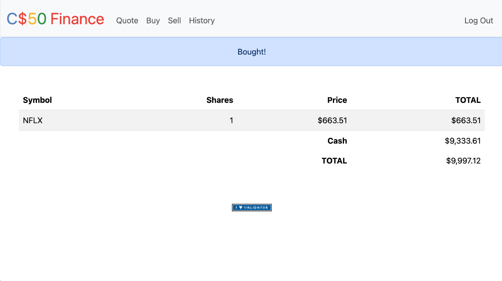

# Finance - Web Track Project

## 📝 Descrição
Finance é uma aplicação web que simula uma plataforma de negociação de ações. Os usuários podem registrar-se, fazer login, consultar cotações em tempo real, comprar e vender ações, além de gerenciar seu portfólio e histórico de transações.



## 🔧 Tecnologias Utilizadas
- Python 3.x
- Flask (Framework web)
- SQLite (Banco de dados)
- HTML/CSS
- CS50 Library
- Werkzeug (Segurança)
- Flask-Session
- Python-dotenv

## 🚀 Funcionalidades

### Autenticação
- Registro de usuários com validações de segurança
  - Username mínimo de 4 caracteres
  - Senha forte (mínimo 8 caracteres, números, letras e símbolos)
  - Verificação de usernames duplicados
- Login/Logout com sessão segura
- Hash de senhas com Werkzeug

### Gestão de Portfólio
- Visualização do portfólio atual
- Cotações em tempo real
- Cálculo automático do valor total das ações
- Exibição do saldo disponível

### Operações Financeiras
- **Compra de Ações**
  - Verificação de saldo disponível
  - Atualização automática do portfólio
  - Registro no histórico de transações

- **Venda de Ações**
  - Verificação de ações disponíveis
  - Atualização automática do portfólio
  - Registro no histórico de transações

- **Gestão de Fundos**
  - Depósito de fundos com verificação de senha
  - Saque de fundos com verificação de saldo
  - Atualização automática do saldo

### Consultas e Histórico
- Consulta de cotações em tempo real
- Histórico completo de transações
- Acompanhamento de ganhos/perdas

## 📦 Pré-requisitos

1. Python 3.x instalado
2. Pip (gerenciador de pacotes Python)
3. Chave de API para cotações (IEX Cloud)
4. SQLite3

## ⚙️ Configuração

1. Clone o repositório:
```bash
git clone https://seu-repositorio/finance.git
cd finance
```

2. Instale as dependências:
```bash
pip install -r requirements.txt
```

3. Configure as variáveis de ambiente:
Crie um arquivo `.env` na raiz do projeto:
```env
API_KEY=sua_chave_api_aqui
FLASK_APP=application.py
FLASK_DEBUG=1
```

4. Inicialize o banco de dados:
```bash
flask init-db
```

## 🗄️ Estrutura do Banco de Dados

### Tabela users
- id (INTEGER PRIMARY KEY)
- username (TEXT NOT NULL)
- hash (TEXT NOT NULL)
- cash (NUMERIC, DEFAULT 10000.00)

### Tabela portfolios
- id (INTEGER PRIMARY KEY)
- user_id (INTEGER)
- name (TEXT)
- symbol (TEXT)
- shares (INTEGER)
- paid_price (NUMERIC)
- current_price (NUMERIC)
- date (TIMESTAMP)
- stock_value (NUMERIC)

### Tabela history
- id (INTEGER PRIMARY KEY)
- user_id (INTEGER)
- name (TEXT)
- symbol (TEXT)
- shares (INTEGER)
- action (TEXT)
- balance (TEXT)
- date (TIMESTAMP)

## 🚀 Como Executar

1. Certifique-se de que todas as dependências estão instaladas
2. Configure as variáveis de ambiente
3. Execute o servidor Flask:
```bash
flask run
```
4. Acesse http://localhost:5000 no navegador

## 🔒 Segurança
- Senhas armazenadas com hash
- Proteção contra SQL Injection
- Validação de formulários
- Sessões seguras
- Verificação de autenticação em rotas protegidas
- Verificação de saldo para operações financeiras

## 📝 Notas
- O saldo inicial para novos usuários é de $10,000.00
- As cotações são atualizadas em tempo real via API
- Todas as transações são registradas com timestamp
- O sistema usa USD (dólar americano) como moeda padrão

## 🛠️ Troubleshooting

### Erros Comuns
1. API_KEY não configurada
```bash
RuntimeError: API_KEY not set
```
Solução: Configure a API_KEY no arquivo .env

2. Erro de dependências
```bash
ModuleNotFoundError: No module named 'flask'
```
Solução: Execute `pip install -r requirements.txt`

